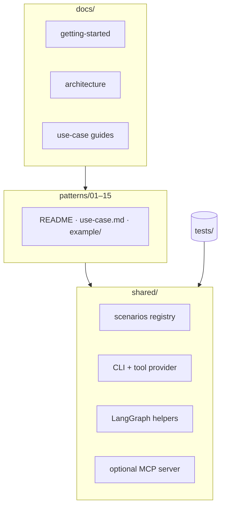
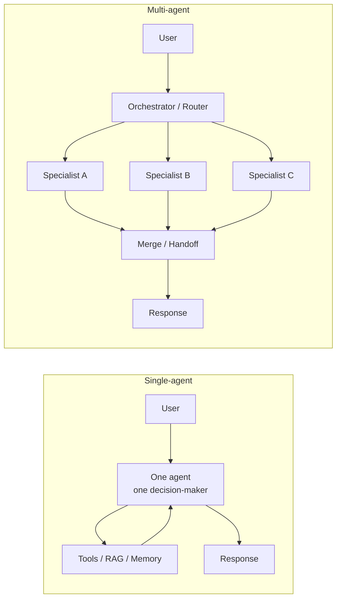
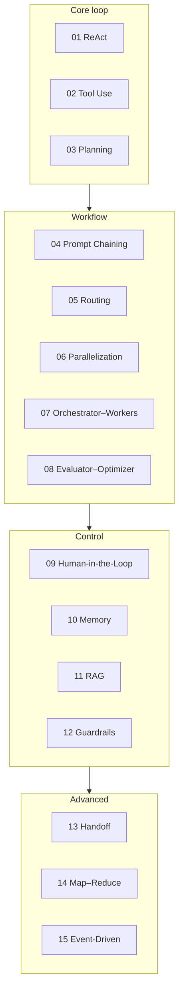
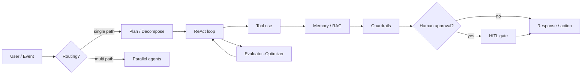
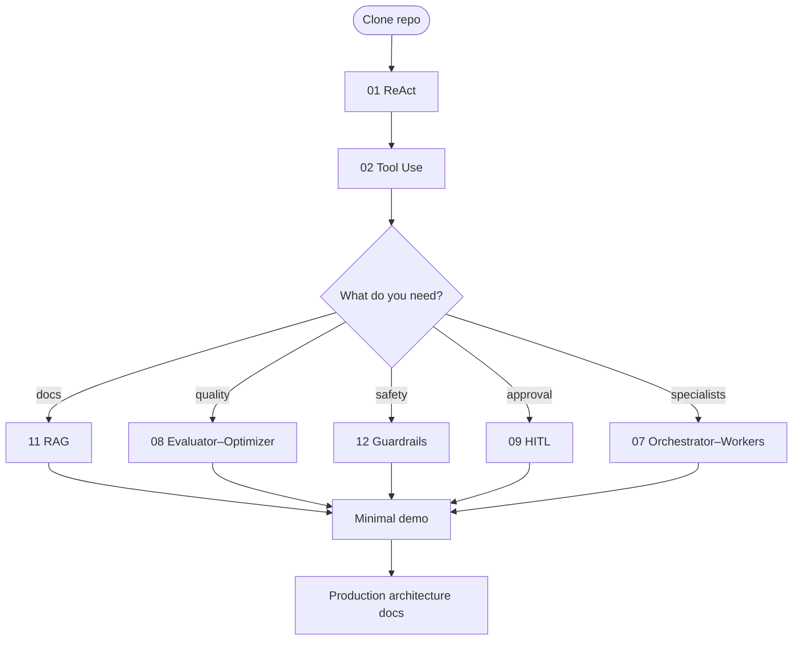

## Introduction


Reading about "agentic AI" is easy. Building an agent that **reasons, calls tools, remembers context, and fails safely** is harder — especially when every tutorial shows a different domain, a different framework, and a different architecture.

I built [**agentic-ai-overview**](https://github.com/mk-hasan/agentic-ai-overview) to fix that. It is a hands-on catalog of **15 agentic AI design patterns**, each with **runnable LangGraph examples** and **three shared real-world scenarios**. Run the same pattern against IT helpdesk, e-commerce support, or an ML demand-forecast pipeline — and compare how the pattern behaves without rewriting domain logic.

This is **Part 1** of a four-part series:

| Part | Topic |
|------|-------|
| **1 (this post)** | The catalog, mental model, and learning path |
| [Part 2](/blog/agentic-ai-overview-2) | Three scenarios and the shared runtime |
| [Part 3](/blog/agentic-ai-overview-3) | Foundation & workflow patterns (01–06) |
| [Part 4](/blog/agentic-ai-overview-4) | Control, multi-agent, and production (07–15) |

---

## Why I Built This

Most agent content falls into two buckets:

1. **Concept posts** — great diagrams, no runnable code
2. **Framework tutorials** — runnable code, but one pattern, one domain, hard to compare

I wanted a repo where you can answer questions like:

- What does **Routing** look like vs **Orchestrator–Workers** on the *same* ticket?
- How does **ReAct** differ from **Prompt Chaining** when the tools stay identical?
- When do I add **RAG**, **Guardrails**, or **Human-in-the-Loop** — and in what order?

The trick is **scenario consistency**. Every pattern example accepts `--scenario helpdesk|ecommerce|demand-forecast` and shares mock tools, prompts, and CLI flags from `shared/`.

---

## What the Repo Contains



| Layer | What you get |
|-------|--------------|
| **Patterns** (`patterns/01–15`) | One folder per design pattern: concept README, use-case template, working `example/` |
| **Scenarios** (`shared/examples/`) | Three domains with mock tools, prompts, and data — swap via `--scenario` |
| **Shared runtime** (`shared/`) | LLM clients, CLI, LangGraph helpers, optional MCP server |
| **Docs** (`docs/`) | Architecture, pattern index, run commands, production guides |
| **Tests** (`tests/`) | 45+ unit tests — no API keys required |

---

## Single-Agent vs Multi-Agent

Before picking a pattern, decide your architecture. Most production systems should **start single-agent** and add multi-agent only when prompts, tools, or audit boundaries overflow one identity.



| Question | Lean single-agent | Lean multi-agent |
|----------|-------------------|------------------|
| Domain breadth | One clear domain | Multiple specialties |
| Latency budget | Tight | Can afford coordination |
| Audit needs | One owner is fine | Need per-role traceability |
| Implementation time | Faster to ship | More state wiring |

**Practical rule:** start with **ReAct + Tool Use + Guardrails**. Add **Orchestrator–Workers** or **Handoff** when one agent's prompt and tool set becomes unmanageable.

---

## The 15 Patterns at a Glance



| # | Pattern | Category | Best first scenario |
|---|---------|----------|---------------------|
| 01 | ReAct | Core loop | Any — **start here** |
| 02 | Tool Use | Core loop | Any tool-using agent |
| 03 | Planning | Core loop | demand-forecast (ML pipeline) |
| 04 | Prompt Chaining | Workflow | Fixed multi-step pipelines |
| 05 | Routing | Workflow | helpdesk (VPN vs email vs password) |
| 06 | Parallelization | Workflow | FAQ + status checks at once |
| 07 | Orchestrator–Workers | Workflow | demand-forecast (MLDLC specialists) |
| 08 | Evaluator–Optimizer | Workflow | Improve answer quality |
| 09 | Human-in-the-Loop | Control | Approve tickets, refunds, model deploy |
| 10 | Memory | Control | Multi-turn follow-ups |
| 11 | RAG | Control | FAQ / playbook retrieval |
| 12 | Guardrails | Control | PII and policy checks |
| 13 | Handoff | Advanced | Tier-1 → Tier-2 escalation |
| 14 | Map–Reduce | Advanced | Summarize many incident logs |
| 15 | Event-Driven | Advanced | Inbound email / retrain events |

Full index in the repo: [patterns/README.md](https://github.com/mk-hasan/agentic-ai-overview/blob/main/patterns/README.md)

---

## How Patterns Compose (Mental Model)

Not every system uses every pattern. This diagram shows how they often layer in a real agent:



Your social-multi-agent feed project is a concrete instance of this: **Orchestrator** (coordinator) → **Generator–Critic** (composer/validator) → **Tool use** (REST API) → **Multi-agent handoff** (commenter/liker).

---

## Suggested Learning Path



**Phase 1 — Foundation:** 01 ReAct → 02 Tool Use → 03 Planning

**Phase 2 — Quality & knowledge:** 11 RAG → 08 Evaluator–Optimizer → 12 Guardrails

**Phase 3 — Workflow:** 04 Prompt Chaining → 05 Routing → 06 Parallelization

**Phase 4 — Multi-agent:** 07 Orchestrator–Workers → 13 Handoff → 14 Map–Reduce

**Phase 5 — Production shapes:** 09 HITL → 10 Memory → 15 Event-Driven

---

## Quick Start

```bash
git clone https://github.com/mk-hasan/agentic-ai-overview.git
cd agentic-ai-overview
python -m venv .venv && source .venv/bin/activate
pip install -e .
cp .env.example .env
# Set OPENAI_API_KEY and/or DEEPSEEK_API_KEY

python patterns/01-react/example/main.py --scenario helpdesk --provider deepseek
python patterns/02-tool-use/example/main.py --scenario ecommerce --provider deepseek
```

Optional extras: `pip install -e ".[dev]"` (pytest + SQLite checkpointer), `".[ml]"` (MLflow), `".[mcp]"` (MCP tool server).

---

## What's Next

**Part 2** dives into the **three scenarios** (helpdesk, e-commerce, demand-forecast) and the **shared runtime** — scenario registry, CLI flags, tool provider, and optional MCP transport.

Then Part 3 walks through foundation and workflow patterns with LangGraph graphs you can run today. Part 4 covers control patterns, multi-agent coordination, and the production architecture guides.

Repo: [github.com/mk-hasan/agentic-ai-overview](https://github.com/mk-hasan/agentic-ai-overview)
