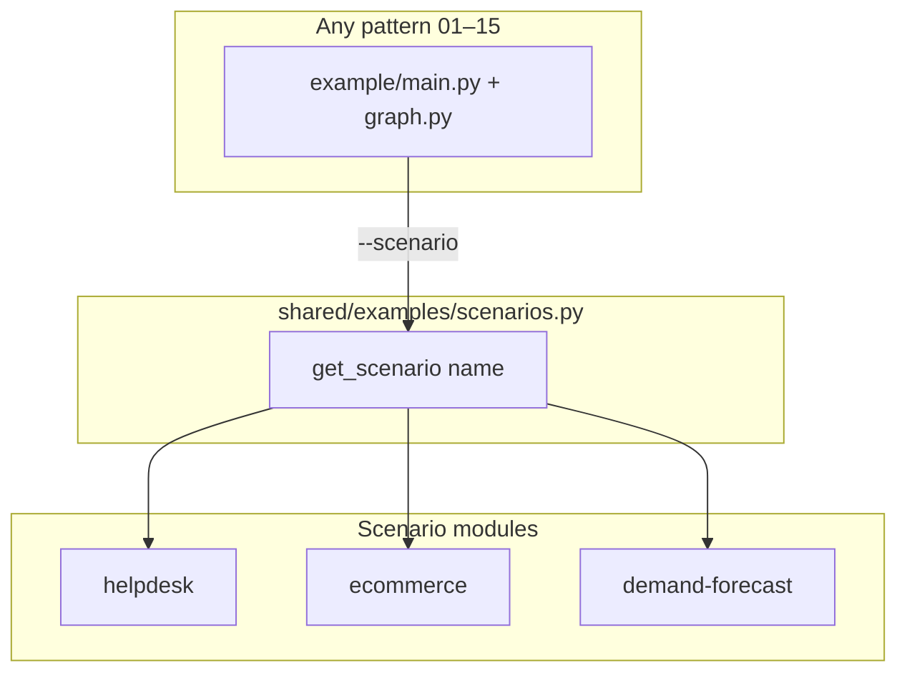
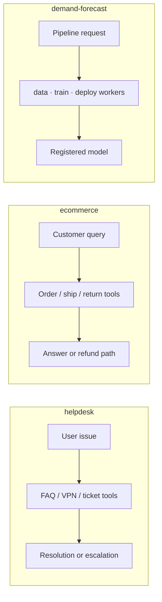
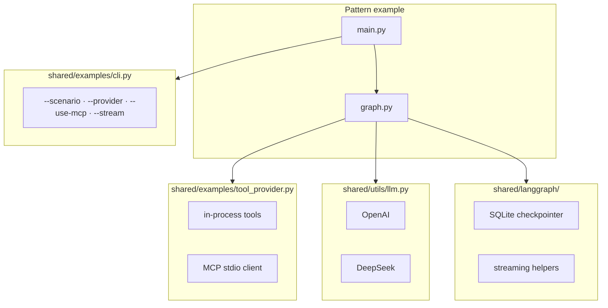
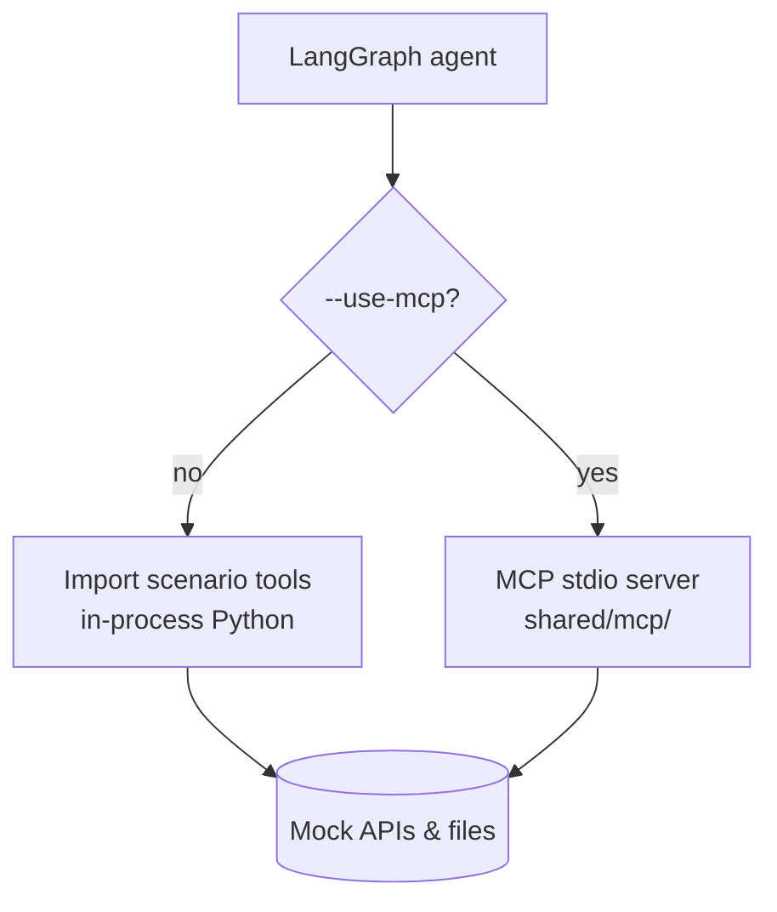
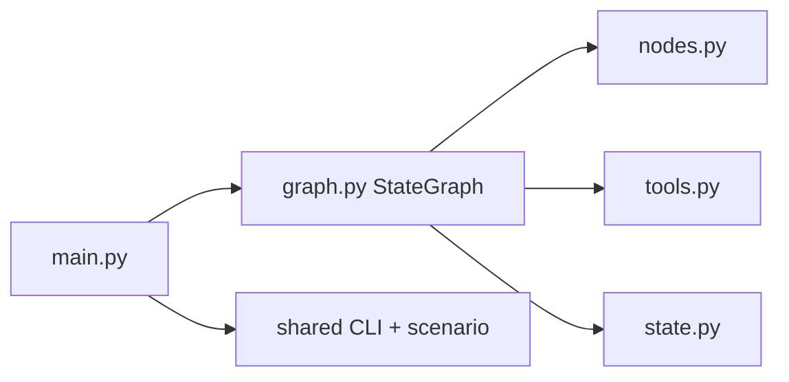

## Introduction

In [Part 1](/blog/agentic-ai-overview-1), I introduced the catalog: 15 design patterns, one repo, one learning path. The secret sauce that makes comparison possible is the **shared scenario layer** — three complete domains wired into every pattern example through a single `--scenario` flag.

This post covers **what those scenarios are**, **how the shared runtime works**, and **how tools reach the agent** (in-process or via MCP).

---

## Why Three Scenarios?

If every pattern hard-coded its own mock API, you could not answer: *"Does Routing help more in support tickets or order lookups?"*

The repo fixes domain logic once in `shared/examples/` and lets each pattern focus on **orchestration shape**.



Every scenario exposes the same contract: prompts, tool catalogs, routing labels, worker definitions, RAG corpora paths, and HITL side-effect tools — so pattern code stays generic.

---

## The Three Scenarios

| Scenario | Domain | Example question | Notable tools |
|----------|--------|------------------|---------------|
| **helpdesk** | Corp IT support | VPN keeps disconnecting | FAQ search, ticket creation, VPN status |
| **ecommerce** | Order support | Where is order #48291? | Order lookup, shipping, returns, refunds |
| **demand-forecast** | ML pipeline (MLDLC) | Train & deploy SKU forecast | Load data, train model, MLflow, register model |



### helpdesk — IT support

Best for patterns that involve **routing** (VPN vs password vs email), **HITL** (approve before creating a ticket), **handoff** (Tier-1 → Tier-2), and **RAG** (internal FAQ/playbook).

```bash
python patterns/05-routing/example/main.py --scenario helpdesk --provider deepseek
python patterns/09-human-in-the-loop/example/main.py --scenario helpdesk --auto-approve
```

### ecommerce — order support

Best for **tool use**, **guardrails** (PII, refund policy), and **evaluator–optimizer** (polish customer-facing replies).

```bash
python patterns/02-tool-use/example/main.py --scenario ecommerce
python patterns/12-guardrails/example/main.py --scenario ecommerce
```

### demand-forecast — ML pipeline

Best for **planning**, **orchestrator–workers** (data / modeling / deploy specialists), **parallelization**, and **event-driven** retrain triggers. Uses MLflow by default; pass `--no-mlflow` for mock tracking.

```bash
python patterns/07-orchestrator-workers/example/main.py --scenario demand-forecast --no-mlflow
python patterns/15-event-driven/example/main.py --scenario demand-forecast
```

---

## Shared Runtime Architecture



| Module | Purpose |
|--------|---------|
| `shared/examples/scenarios.py` | `get_scenario()` registry — single import for all domain data |
| `shared/examples/cli.py` | Shared CLI flags across every pattern |
| `shared/examples/tool_provider.py` | Local tools or MCP (`--use-mcp`) |
| `shared/utils/llm.py` | `get_chat_model(provider="openai"\|"deepseek")` |
| `shared/langgraph/` | SQLite checkpointer, streaming, time-travel helpers |
| `shared/mcp/` | Optional MCP tool server (stdio) |

---

## Common CLI Flags

Every pattern example shares the same CLI surface:

| Flag | Purpose |
|------|---------|
| `--scenario helpdesk\|ecommerce\|demand-forecast` | Pick use case (default: helpdesk) |
| `--provider openai\|deepseek` | LLM provider |
| `--use-mcp` | Load tools from local MCP server instead of in-process |
| `--no-mlflow` | Mock ML tracking for demand-forecast |
| `--stream` / `--no-stream` | Token streaming (default on for helpdesk/ecommerce) |
| `--stream-events` | Graph node updates (default on for demand-forecast in 07/15) |

Pattern-specific flags (e.g. `--auto-approve`, `--time-travel` on HITL) are documented in each pattern's `example/README.md`.

---

## Tool Delivery: In-Process vs MCP



**In-process (default):** fastest for learning — tools are plain Python functions registered with LangChain `@tool`.

**MCP (`--use-mcp`):** same tool contracts exposed over the [Model Context Protocol](https://modelcontextprotocol.io/). Useful when you want agents to call tools the way production systems do — separate process, explicit schema, swappable server.

```bash
pip install -e ".[mcp]"
python patterns/01-react/example/main.py --use-mcp --scenario helpdesk
```

---

## LangGraph Conventions

All examples use **LangGraph** with **LangChain Core** messages and tools. Standard layout per pattern:

```
patterns/XX-name/example/
├── main.py       # Entry point
├── graph.py      # StateGraph definition
├── tools.py      # @tool definitions (when applicable)
├── nodes.py      # Optional: split node logic
├── state.py      # Optional: custom TypedDict state
└── README.md     # How to run
```



Install once from repo root: `pip install -e .` — makes `shared` importable without `PYTHONPATH`.

---

## Scenario Registry Internals

The `Scenario` dataclass in `scenarios.py` bundles everything a pattern might need:

- System prompts (base, tier-1, tier-2, router, orchestrator)
- Tool name lists per route / worker / parallel check
- Worker definitions for orchestrator–workers
- RAG retrieval hooks and incident log paths for map–reduce
- HITL side-effect tool reference

Patterns call `get_scenario("helpdesk")` and pull only what they need. A routing graph reads `route_names` and `route_prompt_keys`; an orchestrator reads `orchestrator_workers` and `worker_tool_names`.

This is **dependency injection for domains** — the graph topology changes per pattern; the scenario stays stable.

---

## Running All Patterns

The repo includes a copy-paste command list for every pattern × scenario combination:

[docs/use-cases/run-all-examples.md](https://github.com/mk-hasan/agentic-ai-overview/blob/main/docs/use-cases/run-all-examples.md)

Quick smoke test (no API key needed for unit tests):

```bash
pip install -e ".[dev]"
pytest
```

45+ tests cover scenario tools, CLI flag wiring, orchestrator parsing, worker subgraphs, and checkpointer helpers.

---

## What's Next

**Part 3** walks through **foundation and workflow patterns** (01–06): ReAct, Tool Use, Planning, Prompt Chaining, Routing, and Parallelization — with LangGraph flow diagrams for each.

**Part 4** covers control patterns (HITL, Memory, RAG, Guardrails), multi-agent patterns (Orchestrator–Workers, Handoff, Map–Reduce, Event-Driven), and the production architecture guides.
