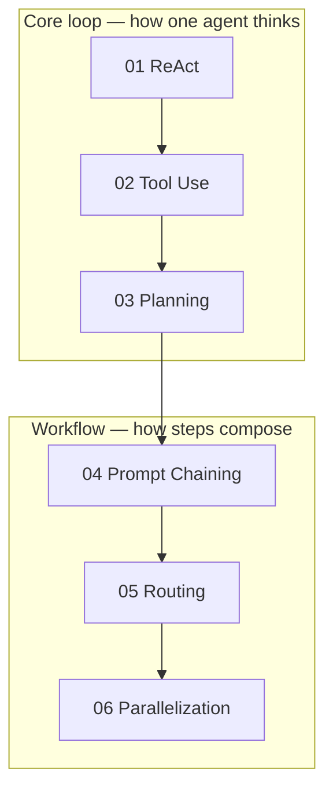
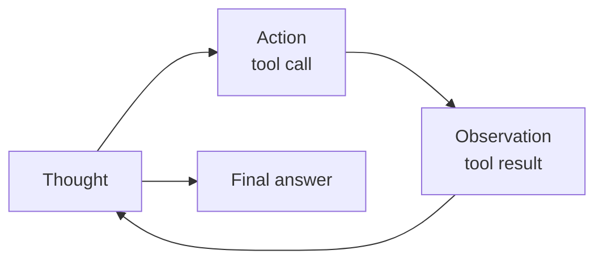
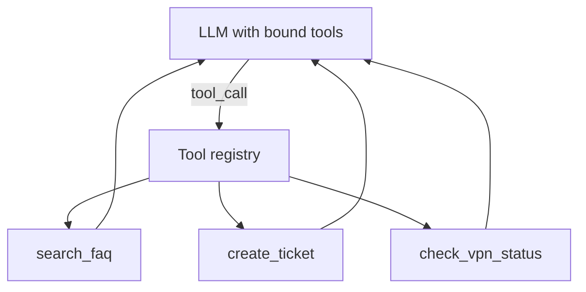
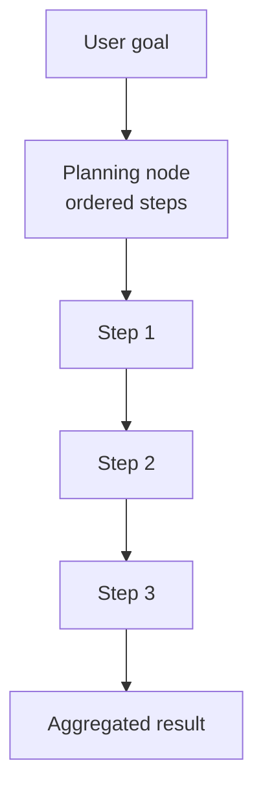
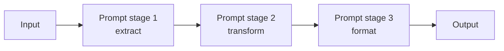
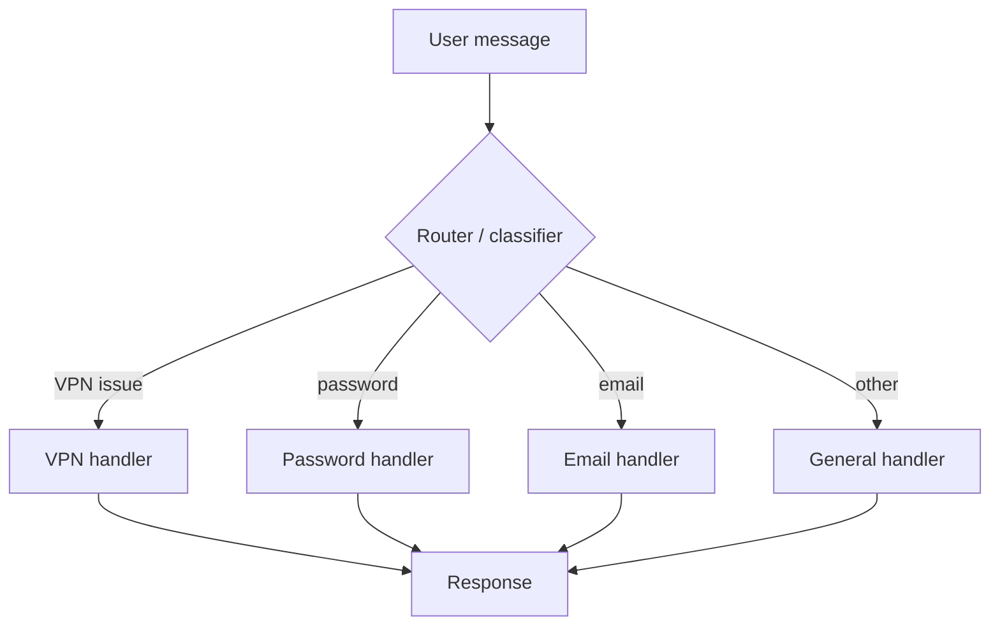
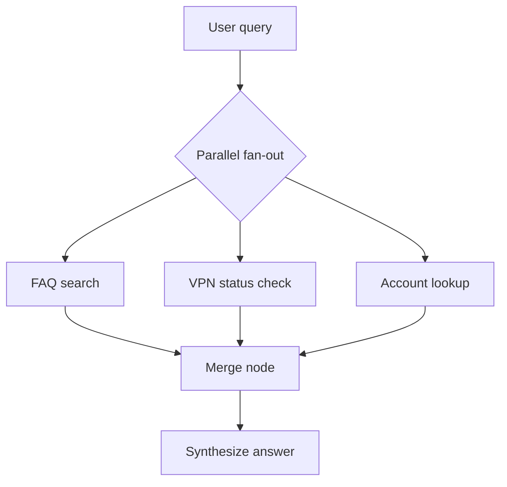
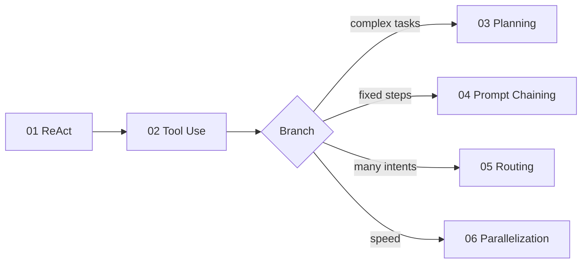

## Introduction

[Part 1](/blog/agentic-ai-overview-1) introduced the catalog. [Part 2](/blog/agentic-ai-overview-2) covered scenarios and shared runtime. This post opens the first six pattern folders — the **core loops** and **workflow composition** patterns that most agent systems build on.

All examples live in [agentic-ai-overview](https://github.com/mk-hasan/agentic-ai-overview) and run with:

```bash
python patterns/XX-name/example/main.py --scenario helpdesk|ecommerce|demand-forecast
```

---

## Pattern Map (01–06)



| # | Pattern | Single vs multi | Primary scenario |
|---|---------|-----------------|------------------|
| 01 | ReAct | Single | All |
| 02 | Tool Use | Single | All |
| 03 | Planning | Single | demand-forecast |
| 04 | Prompt Chaining | Single | Fixed pipelines |
| 05 | Routing | Either | helpdesk |
| 06 | Parallelization | Either | helpdesk / ecommerce |

---

## 01 — ReAct (Reason + Act)

**What it is:** The default loop for tool-using agents — **think → act → observe → repeat** until the task is done.



**When to use:** Multi-step tasks with external feedback (search, APIs, code execution). **Always learn this first** — every other single-agent pattern builds on or wraps this loop.

**When not to use:** Single-shot Q&A with no tools; ultra-tight latency budgets where planning overhead hurts.

```bash
python patterns/01-react/example/main.py --scenario helpdesk --provider deepseek
```

Structure in code: LangGraph `StateGraph` with an LLM node and `ToolNode`, conditional edge via `tools_condition` — loop until no more tool calls.

<Callout type="note">
ReAct without tools is just chain-of-thought. Pattern **02** makes the action layer explicit.
</Callout>

---

## 02 — Tool Use / Function Calling

**What it is:** How the agent **affects the world** — structured tool schemas, argument validation, and result handling.



**When to use:** Any agent that reads data or triggers side effects. Often implemented *inside* ReAct, but pattern 02 isolates the tool catalog and calling conventions.

```bash
python patterns/02-tool-use/example/main.py --scenario ecommerce --provider deepseek
```

Compare `--use-mcp` to see the same tools over MCP instead of in-process imports.

---

## 03 — Planning & Task Decomposition

**What it is:** Explicit **plan before execute** — the agent (or a planning node) decomposes a goal into steps, then executes them sequentially or hands them to sub-loops.



**When to use:** Complex tickets, ML pipelines, any task where jumping straight into tool calls wastes tokens.

**Best scenario:** `demand-forecast` — load data → feature engineering → train → evaluate → register model.

```bash
python patterns/03-planning/example/main.py --scenario demand-forecast --no-mlflow
```

---

## 04 — Prompt Chaining

**What it is:** A **fixed sequence** of LLM calls where each stage's output feeds the next. No dynamic tool loop — predictable pipeline.



**When to use:** Stable ETL-style text workflows, report generation, classification → summarization → formatting.

**When not to use:** User intent varies wildly (use Routing or ReAct instead).

```bash
python patterns/04-prompt-chaining/example/main.py --scenario helpdesk
```

Contrast with ReAct: chaining has **no observation loop** — the path is predetermined.

---

## 05 — Routing

**What it is:** Classify intent (or event type), then send work down **different handlers** — each with its own prompt and tool subset.



**When to use:** Distinct intents with different tools and policies. Entry point for **multi-agent** systems (router → specialist).

**Best scenario:** `helpdesk` — VPN disconnect vs password reset vs Outlook issues.

```bash
python patterns/05-routing/example/main.py --scenario helpdesk --provider deepseek
```

Routing is lighter than full Orchestrator–Workers: specialists can still be single ReAct loops behind each branch.

---

## 06 — Parallelization

**What it is:** Run **independent checks or sub-tasks concurrently**, then merge results.



**When to use:** Latency-sensitive support flows where checks do not depend on each other.

```bash
python patterns/06-parallelization/example/main.py --scenario helpdesk
```

LangGraph implements this with parallel edges or `Send` API patterns — see each `graph.py` for the exact topology.

---

## How 01–06 Compare on the Same Question

Run the helpdesk scenario across patterns to see behavioral differences:

| Pattern | Same question: "VPN drops every 10 minutes" | Behavior |
|---------|-----------------------------------------------|----------|
| **01 ReAct** | Agent reasons step-by-step, picks tools dynamically | Exploratory loop |
| **02 Tool Use** | Focus on which tools get called and how | Explicit catalog |
| **05 Routing** | Classifies as VPN route first | Intent gate |
| **06 Parallelization** | FAQ + VPN status in parallel | Faster merge |

```bash
python patterns/01-react/example/main.py --scenario helpdesk "VPN drops every 10 minutes"
python patterns/05-routing/example/main.py --scenario helpdesk "VPN drops every 10 minutes"
python patterns/06-parallelization/example/main.py --scenario helpdesk "VPN drops every 10 minutes"
```

---

## Suggested Study Order Within Part 3



1. Run **01** until you can read the LangGraph trace
2. Run **02** with `--use-mcp` once
3. Pick **05** (helpdesk) or **03** (demand-forecast) based on your domain
4. Skim **04** and **06** as alternatives to dynamic loops

---

## What's Next

**Part 4** covers patterns **07–15**: Orchestrator–Workers, Evaluator–Optimizer, Human-in-the-Loop, Memory, RAG, Guardrails, Handoff, Map–Reduce, Event-Driven — plus the **production architecture** guides for shipping agents beyond localhost.
