## Introduction

This is the final post in the [agentic-ai-overview](https://github.com/mk-hasan/agentic-ai-overview) series:

| Part | Topic |
|------|-------|
| [Part 1](/blog/agentic-ai-overview-1) | Catalog and learning path |
| [Part 2](/blog/agentic-ai-overview-2) | Scenarios and shared runtime |
| [Part 3](/blog/agentic-ai-overview-3) | Foundation patterns 01–06 |
| **Part 4 (this post)** | Patterns 07–15 and production |

Parts 1–3 built single-agent and workflow skills. Part 4 adds **control** (safety, memory, humans), **multi-agent scale**, and the **production docs** for shipping beyond `python main.py`.

---

## Pattern Map (07–15)

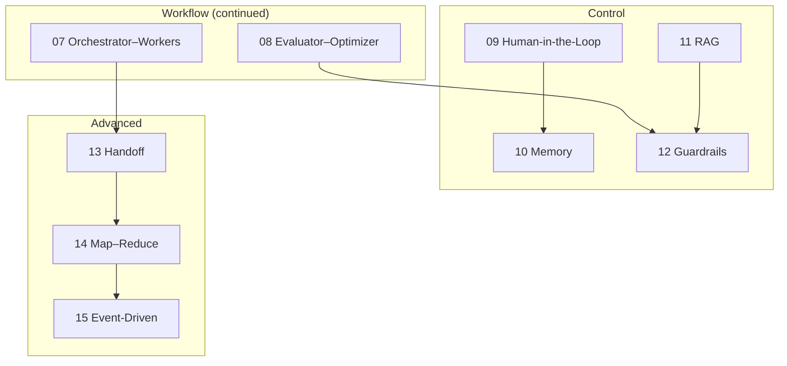

---

## 07 — Orchestrator–Workers

**What it is:** A central **orchestrator** decomposes work and delegates to **specialist workers** — each with its own prompt, tools, and optionally a compiled subgraph.

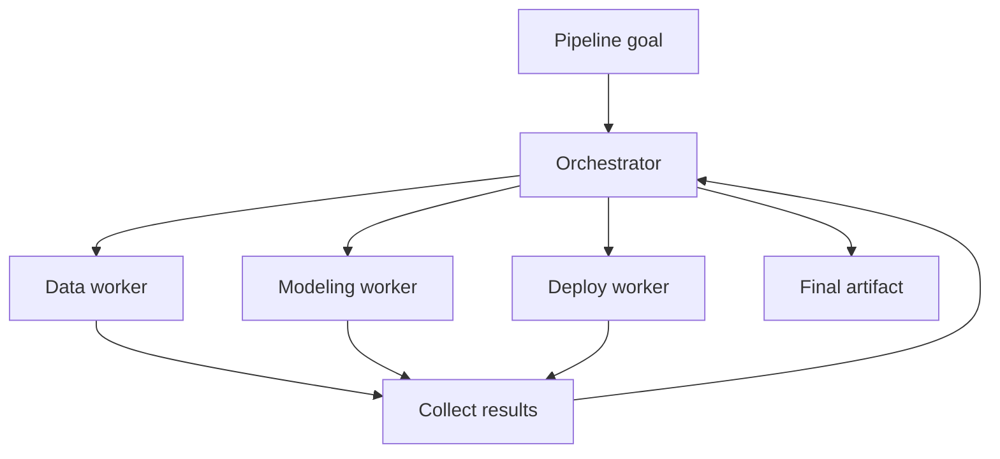

**Best scenario:** `demand-forecast` — MLDLC specialists (data prep, training, deployment).

```bash
python patterns/07-orchestrator-workers/example/main.py --scenario demand-forecast --no-mlflow --stream-events
```

Workers are LangGraph **subgraphs** — inspect `shared/examples/graphs/` for reusable worker builders.

---

## 08 — Evaluator–Optimizer (Reflection)

**What it is:** **Generate → critique → revise** loop. A critic (same or separate LLM call) scores output and feeds back improvement instructions.

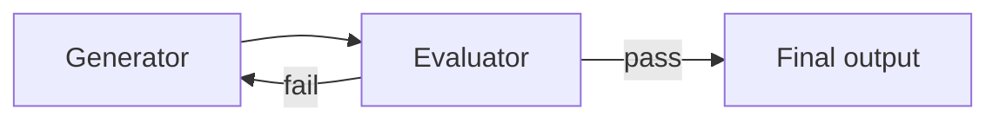

**When to use:** Customer-facing replies, report quality, any task where first-draft LLM output is not good enough.

This is the same **Generator–Critic** pattern used in the [social multi-agent feed project](/blog/social-multi-agent-3) (`post_composer` ↔ `validator`).

```bash
python patterns/08-evaluator-optimizer/example/main.py --scenario ecommerce
```

---

## 09 — Human-in-the-Loop (HITL)

**What it is:** **Pause before side effects** — ticket creation, refunds, model registration — using LangGraph **interrupts** and checkpoint resume.

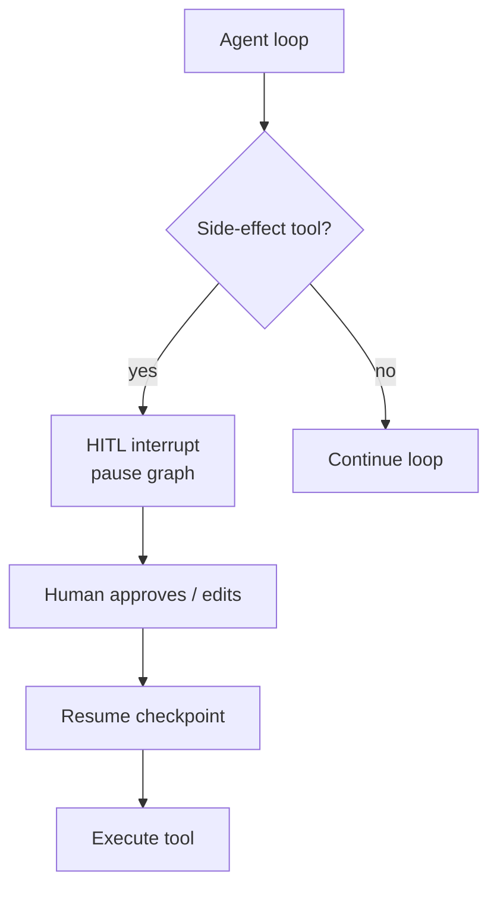

**Features in this repo:** SQLite checkpoints (`data/checkpoints/`), `--auto-approve` for demos, `--time-travel` to rewind state.

```bash
python patterns/09-human-in-the-loop/example/main.py --scenario helpdesk --auto-approve --time-travel
```

---

## 10 — Memory & Context Management

**What it is:** **Short-term** (thread messages, checkpoints) and **long-term** (persisted facts across sessions).

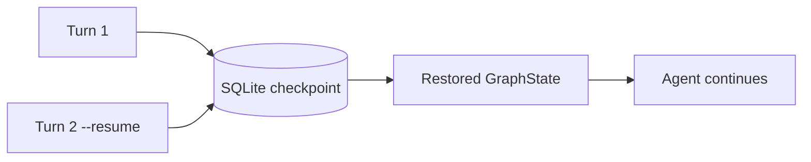

```bash
python patterns/10-memory/example/main.py --scenario helpdesk
```

Pair with HITL: checkpoints enable both **human approval** and **multi-turn follow-ups** on the same `thread_id`.

---

## 11 — RAG (Retrieval-Augmented Generation)

**What it is:** Retrieve relevant chunks from a corpus **before** generation — internal FAQ, playbooks, policy docs.

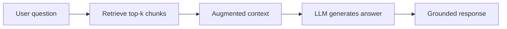

**Best scenario:** `helpdesk` — markdown FAQ corpora with `retrieve_from_markdown` helpers in the scenario module.

```bash
python patterns/11-rag/example/main.py --scenario helpdesk
```

Production scaling (indexing, refresh, chunking) is covered in [docs/architecture/production/rag-at-scale.md](https://github.com/mk-hasan/agentic-ai-overview/blob/main/docs/architecture/production/rag-at-scale.md).

---

## 12 — Guardrails & Safety

**What it is:** Input/output/policy checks **before and after** the agent loop — PII redaction, blocked topics, tool argument validation.

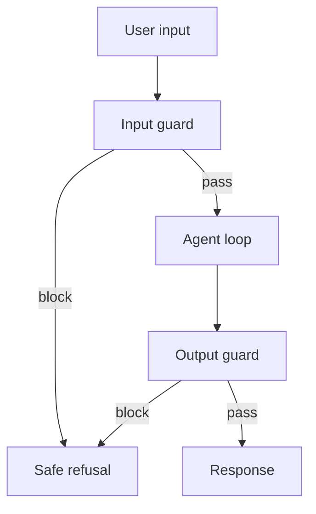

```bash
python patterns/12-guardrails/example/main.py --scenario ecommerce
```

Add guardrails **before** destructive tools in any demo you show to stakeholders.

---

## 13 — Handoff / Delegation

**What it is:** Transfer **control and context** from one agent persona to another mid-conversation — Tier-1 support → Tier-2 specialist.

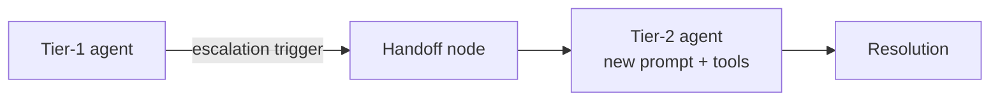

**Best scenario:** `helpdesk` with `handoff_escalation_prompt` in the scenario registry.

```bash
python patterns/13-handoff/example/main.py --scenario helpdesk
```

Differs from **07 Orchestrator–Workers**: handoff is **sequential control transfer**, not parallel delegation from a planner.

---

## 14 — Map–Reduce

**What it is:** **Map** many chunks in parallel (summarize, classify, extract), **reduce** into one aggregate result.

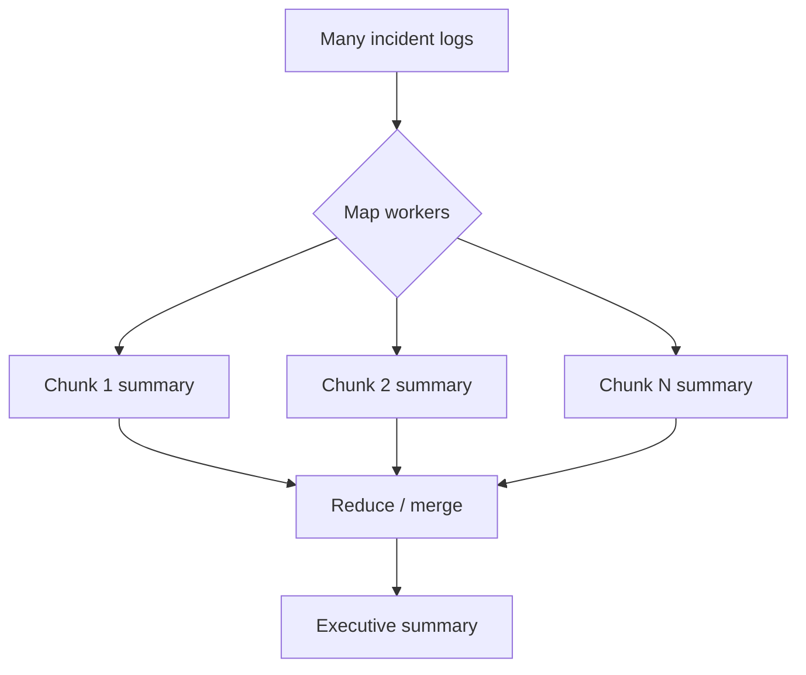

```bash
python patterns/14-map-reduce/example/main.py --scenario helpdesk
```

---

## 15 — Event-Driven Agents

**What it is:** Agents triggered by **events** (inbound email, schedule, model drift) rather than synchronous chat.

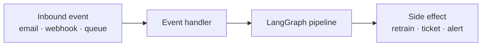

**Best scenario:** `demand-forecast` — retrain trigger when drift is detected.

```bash
python patterns/15-event-driven/example/main.py --scenario demand-forecast --stream-events
```

---

## Cross-Cutting Patterns (Attach to Any Architecture)

These patterns work in **both** single-agent and multi-agent setups:

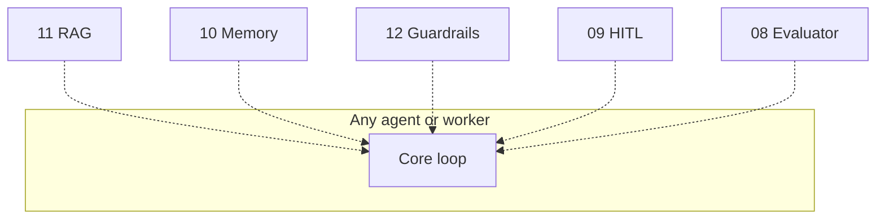

| Pattern | Attaches as… |
|---------|--------------|
| RAG | Pre-generation grounding |
| Memory | Checkpoint + context window |
| Guardrails | Input/output gates |
| HITL | Interrupt before risky tools |
| Evaluator–Optimizer | Post-generation quality loop |

---

## From Examples to Production

The repo's `docs/architecture/production/` folder bridges **pattern examples** → **deployable systems**:

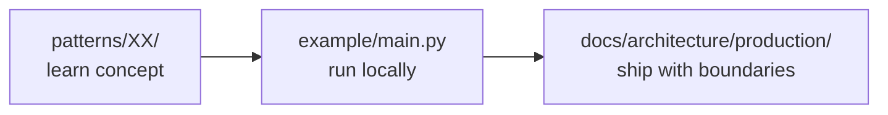

| Guide | What you learn |
|-------|----------------|
| [Reference architecture](https://github.com/mk-hasan/agentic-ai-overview/blob/main/docs/architecture/production/reference-architecture.md) | Sync chat, multi-agent, event-driven topologies |
| [Production concerns](https://github.com/mk-hasan/agentic-ai-overview/blob/main/docs/architecture/production/production-concerns.md) | Timeouts, retries, idempotent tools, audit logs |
| [RAG at scale](https://github.com/mk-hasan/agentic-ai-overview/blob/main/docs/architecture/production/rag-at-scale.md) | Indexing, chunking, refresh |
| [Observability & evals](https://github.com/mk-hasan/agentic-ai-overview/blob/main/docs/architecture/production/observability-and-evals.md) | Traces, tool-call logging, offline eval |
| [Scenario deployments](https://github.com/mk-hasan/agentic-ai-overview/blob/main/docs/architecture/production/scenario-deployments.md) | Helpdesk, e-commerce, ML pipeline as real systems |

### Production topology (reference)

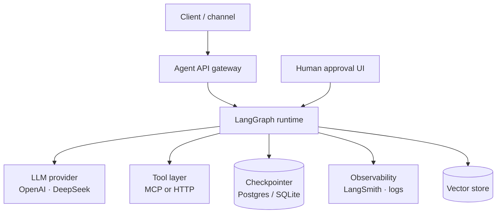

---

## Minimal Production Stack (Recommended First Ship)

| Step | Pattern / doc | Why |
|------|---------------|-----|
| 1 | 01 ReAct + 02 Tool Use | Working agent loop |
| 2 | 12 Guardrails | Block unsafe I/O before demo |
| 3 | 11 RAG (if docs matter) | Ground answers |
| 4 | 09 HITL (if side effects) | Approve refunds / tickets |
| 5 | Production concerns doc | Timeouts, idempotency, audit |

Do **not** start with 07 Orchestrator–Workers in production unless single-agent genuinely failed you.

---

## Series Recap

Over four posts we covered [agentic-ai-overview](https://github.com/mk-hasan/agentic-ai-overview):

1. **The catalog** — 15 patterns, learning path, single vs multi-agent
2. **Shared runtime** — three scenarios, CLI, MCP, LangGraph conventions
3. **Foundation patterns** — ReAct through Parallelization with runnable commands
4. **Advanced patterns** — orchestration, safety, memory, events, and production guides

The repo is GPL-3.0 licensed, Python 100%, with Bangla documentation at [README.bn.md](https://github.com/mk-hasan/agentic-ai-overview/blob/main/README.bn.md).

**Pair this series with:** the [social multi-agent feed project](/blog/social-multi-agent-1) for a full-stack example of Generator–Critic, tool use, and multi-persona agents in production-shaped code.

Clone it, run pattern 01 today, and add patterns only when your use case demands them — that is the point of the catalog.
