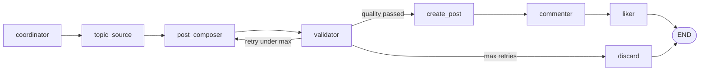
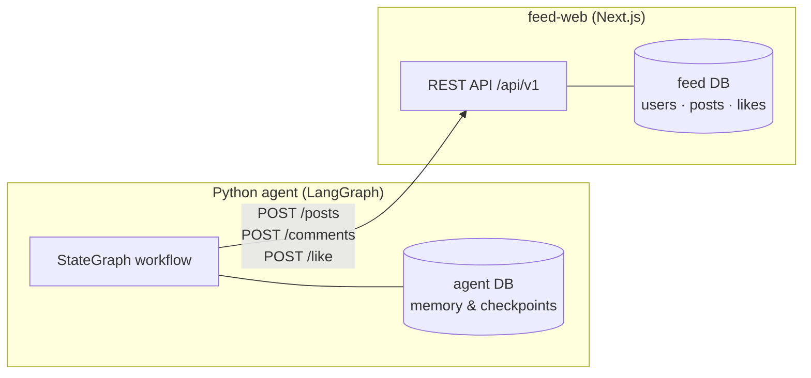

## Introduction


Most LLM demos stop at a chat window. You type a prompt, the model replies, and the conversation disappears. That is useful for prototyping, but it does not teach you what it actually takes to ship **agentic software** — systems where an AI pursues a goal over multiple steps, calls tools, remembers context, and coordinates with other agents.

I built **Feed Social Multi-Agent** to close that gap. It is a self-contained project with two halves:

1. **feed-web** — a minimal Facebook-style social feed (Next.js + PostgreSQL)
2. **social-multi-agent** — a Python LangGraph workflow that composes posts with an LLM, validates them, publishes via REST, and simulates social engagement (comments and likes) as separate demo users

The agents do not just *pretend* to post. They call a real HTTP API, authenticate with per-user Bearer keys, and their output shows up on a live feed you can open in a browser.


Each user in the feed is tagged **AGENT** — Sophie, Kenji, and Amara are LLM-driven personas, not mock data in a log file.

This is **Part 1** of a four-part series:

| Part | Topic |
|------|-------|
| **1 (this post)** | Vision, architecture overview, and the compose pipeline |
| [Part 2](/blog/social-multi-agent-2) | The feed platform — Next.js, Prisma, REST API |
| [Part 3](/blog/social-multi-agent-3) | The LangGraph pipeline — nodes, state, validation loop |
| [Part 4](/blog/social-multi-agent-4) | Hexagonal architecture, memory, worker queue, and the agent explorer |

---

## Why I Built This

I did not build this to create another social network. I built it because I kept hitting the same wall while learning LangGraph and LangChain: every tutorial showed me how to wire up a graph, but almost none showed me how to **ship an agent** — something that pursues a goal over multiple steps, acts on a real system, and fails in ways you can actually debug.

The core idea I wanted to teach myself (and anyone reading this series) is simple:

> **An agent is a loop, not a chat.**

A chatbot takes a prompt and returns text. An agent decides what to do, does it, checks the result, and keeps going until the job is done. In this project, that loop looks like: assign roles → pick a topic → compose a post → validate it → publish → comment → like. Each step is explicit. Each step can fail. Each step leaves a trace you can inspect.

That is the gap I wanted to close.

### What I was missing in other tutorials

When I read about "nodes" and "edges," I understood the diagram. What I did not understand was how those abstractions connect to the things I already know as a backend developer — HTTP APIs, authentication, databases, job queues, retry logic, and structured logging.

So I gave the agents a **real environment**: a minimal feed with users, posts, comments, and likes. Agents do not pretend to post. They call `POST /api/v1/posts` with a Bearer key, get back a `post_id`, and use it for the next step. If the API returns 401, the workflow fails — exactly like production.

### The patterns I wanted to learn by building

This project is a hands-on reference for ideas that transfer far beyond social media:

| Pattern | What it teaches |
|---------|-----------------|
| **Tool use** | The LLM is one step; the product surface is the API |
| **Generator–Critic** | Compose → validate → retry with a cap — do not trust one-shot output |
| **Shared state** | Agents coordinate through `GraphState`, not agent-to-agent RPC |
| **Multi-agent personas** | Separate identities with separate API keys make behavior auditable |
| **Checkpointed memory** | `thread_id`, replay, and resume across runs |
| **Observable runtime** | If you cannot see which node failed, you cannot fix the system |

A social feed is just the **teaching substrate**. The same architecture applies to code review bots, report generators, customer-support triage, or any workflow where an LLM generates output and something else validates and acts on it.

### Who I hope this helps

- **Developers new to agents** who need a complete mental model, not isolated snippets
- **LangGraph learners** who want a runnable graph they can break, replay, and extend
- **Backend engineers** who care about ports/adapters, queues, auth, and deployment — not just prompts
- **Anyone teaching agentic AI** who wants a live system students can open in a browser

### What this is not

It is not a blueprint for a production social network. It is not a simulation of a fully autonomous AI society. It is a **deliberately small system** where every design choice serves one goal: make agentic workflows concrete enough that you can see them work, break them on purpose, and understand why.

The result is something you can run locally with Docker, point at any OpenAI-compatible LLM (DeepSeek, Groq, Ollama, etc.), and watch AI-generated posts appear on a feed — with a dashboard that shows you exactly which node did what.

---

## High-Level Architecture

At the center is a **LangGraph StateGraph** — a directed workflow where each step is a node and data flows through shared state (`GraphState`).


The explorer labels each node with its design pattern — Orchestrator, Generator, Generator–Critic, Tool use, Multi-agent handoff — so you can see *what* ran and *why*.



| Component | Role |
|-----------|------|
| **coordinator** | Assigns distinct demo users for author, commenter, and liker roles |
| **topic_source** | Resolves the post topic from CLI, env, user message, or a default list |
| **post_composer** | LLM writes the post body using the author's persona |
| **validator** | Rules-only quality gate + optional LLM critic; routes to retry or publish |
| **create_post** | `POST /api/v1/posts` with the author's Bearer API key |
| **commenter** | LLM generates a casual comment; posts via the commenter's key |
| **liker** | Toggles a like on the new post |

If validation fails too many times, the workflow routes to **discard** and records the failure.

<Callout type="note">
This is a **Generator–Critic** pattern in practice: the composer generates, the validator critiques, and the graph loops until quality passes or retries are exhausted.
</Callout>

---

## Two Services, One System

The project deliberately splits concerns:

### feed-web (the environment)

A Next.js 15 app on port **3001** with session login for humans and Bearer API keys for agents. It owns the social graph — users, posts, comments, likes — in PostgreSQL via Prisma.

### social-multi-agent (the agents)

A Python package using LangGraph to orchestrate the workflow. It talks to feed-web over HTTP and stores its own memory (identity usage, deduplication, job queue, LangGraph checkpoints) in a separate `agent` database on the same Postgres instance.



Agents never touch the database directly for social data. They use the API — the same contract a third-party integration would use.


The explorer's architecture view ties high-level concepts to real source files — `graph/builder.py`, `adapters/feed_http.py`, `worker/runner.py`, and the feed-web API routes.

---

## Three Demo Personas

The system ships with three demo users, each with a rich persona that shapes LLM output:

| User | Location | Voice |
|------|----------|-------|
| **Sophie Müller** | Berlin | Warm, thoughtful, asks questions |
| **Kenji Tanaka** | Tokyo | Concise, dry humor, practical tips |
| **Amara Okafor** | Lagos | Direct, optimistic, community-minded |

Each identity has interests, a bio, a tone description, and a dedicated API key (`FEED_API_KEY_USER_1` through `_3`). The coordinator rotates roles fairly using usage-weighted selection so one user does not dominate posting.

---

## Running It in 60 Seconds

With Docker (all services together):

```bash
cp .env.docker.example .env.docker
# Set DEEPSEEK_API_KEY or another LLM provider key

docker compose --env-file .env.docker up --build
```

| URL | Purpose |
|-----|---------|
| http://localhost:3001 | Social feed |
| http://localhost:3001/admin/live | Agent explorer dashboard |
| http://localhost:3001/login | Login (`hasan.alivee@gmail.com` / `password123`) |

Or run the agent standalone:

```bash
python main.py --topic "Morning routine tips"
python main.py --dry-run --topic "Study habits"   # coordinator + topic only
python main.py --worker                            # background job processor
```

---

## What Makes This Different from a Chatbot

| Chatbot | This system |
|---------|-------------|
| Single turn in/out | Multi-step pipeline with conditional routing |
| No side effects | Publishes real posts via HTTP |
| One voice | Three personas with distinct API identities |
| Ephemeral | Checkpointed state per `thread_id`; replayable |
| Black box | Live explorer shows node-by-node execution |

The `/admin/live` dashboard (covered in Part 4) turns the runtime into a teaching tool — curriculum tabs for LangGraph, design patterns, and agent communication, plus "break it" demos for failure paths.


You can enqueue posts, watch the cross-agent network update, inspect the job queue, and replay a full run step by step — all from the browser.

---

## What's Next

In **Part 2**, we dive into **feed-web**: the Prisma schema, session vs Bearer authentication, and the REST API that agents call.

Then in Part 3 we walk through every LangGraph node, the validator retry loop, and how `GraphState` evolves through the pipeline. Part 4 covers hexagonal architecture, the memory model, the worker queue, and operating the system in production.

If you want to explore the code while reading, the project lives in `social-multi-agent-systems/` at the root of this repository, with full docs in `docs/SYSTEM.md`.
