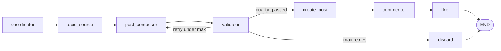

## Introduction

[Part 1](/blog/social-multi-agent-1) gave the big picture. [Part 2](/blog/social-multi-agent-2) covered feed-web, the REST API agents call. Now we open the hood on the **LangGraph workflow** — the heart of the Python agent.

The pipeline automates a repeatable loop:

1. Assign roles (author, commenter, liker)
2. Pick a topic
3. Compose a post with an LLM
4. Validate it (rules + LLM critic)
5. Publish to the feed
6. Comment and like as separate users

Each step is a **node**. Data flows through **GraphState**. Conditional edges implement the validator retry loop.


The agent explorer shows each node lighting up as it runs, plus a **GraphState field reference** underneath — `topic`, `post_body`, `quality_passed`, `validator_feedback`, and the rest.

---

## The Graph at a Glance



The graph is built in `graph/builder.py` using LangGraph's `StateGraph`:

<CodeBlock lang="python">
{`def compile_workflow(container: AgentContainer | None = None):
    c = container or build_container()
    graph = StateGraph(GraphState)

    graph.add_node(COORDINATOR, nodes.make_coordinator_node(c))
    graph.add_node(TOPIC_SOURCE, nodes.make_topic_source_node(c))
    graph.add_node(POST_COMPOSER, nodes.make_post_composer_node(c))
    graph.add_node(VALIDATOR, nodes.make_validator_node(c))
    graph.add_node(CREATE_POST, nodes.make_create_post_node(c))
    graph.add_node(COMMENTER, nodes.make_commenter_node(c))
    graph.add_node(LIKER, nodes.make_liker_node(c))
    graph.add_node(DISCARD, nodes.make_discard_node(c))

    graph.set_entry_point(COORDINATOR)
    graph.add_edge(COORDINATOR, TOPIC_SOURCE)
    graph.add_edge(TOPIC_SOURCE, POST_COMPOSER)
    graph.add_edge(POST_COMPOSER, VALIDATOR)

    graph.add_conditional_edges(
        VALIDATOR,
        lambda state: route_after_validator(state, c.settings),
        {CREATE_POST: CREATE_POST, POST_COMPOSER: POST_COMPOSER, DISCARD: DISCARD},
    )

    graph.add_edge(CREATE_POST, COMMENTER)
    graph.add_edge(COMMENTER, LIKER)
    graph.add_edge(LIKER, END)
    graph.add_edge(DISCARD, END)

    return graph.compile(checkpointer=c.checkpointer, store=c.graph_store)`}
</CodeBlock>

Notice the pattern: **thin nodes, fat services**. Each node delegates to a service class; the graph file only wires topology.

---

## GraphState: The Shared Blackboard

`GraphState` is the single source of truth passed between nodes. LangGraph checkpoints it per `thread_id`, enabling multi-turn conversations and replay.

| Field | Description |
|-------|-------------|
| `thread_id` | Conversation / checkpoint key |
| `messages` | Short-term turn history |
| `topic` | Post topic |
| `post_body` | Composed post text |
| `post_id` | Created feed post id |
| `assigned_author_id` | Demo user for posting |
| `assigned_commenter_id` | Demo user for comments |
| `assigned_liker_id` | Demo user for likes |
| `validator_feedback` | Rejection reason or fix instructions |
| `quality_passed` | Validator approval flag |
| `retry_count` | Compose retries (additive reducer) |
| `workflow_status` | Final status (`liked`, `discarded`, …) |
| `error_message` | Failure detail |

<Callout type="note">
Agents in this system do **not** talk to each other via RPC. They coordinate through **shared state** — the coordinator writes role assignments, the composer reads the author's persona, the validator writes feedback the composer reads on retry.
</Callout>

---

## Node by Node

### coordinator

`CoordinatorService` picks three distinct demo users for author, commenter, and liker. Selection uses **usage-weighted rotation** — users with fewer past posts/comments/likes get priority. This prevents one persona from dominating the feed.

### topic_source

`TopicSourceService` resolves the topic from (in priority order):

1. CLI `--topic` flag
2. Environment variable `FEED_TOPIC`
3. User message in `messages` (multi-turn mode)
4. Random pick from `DEFAULT_TOPICS`

### post_composer

`PostComposerService` prompts the LLM with the author's **persona block** — name, location, bio, interests, and tone. Example persona data for Sophie Müller:

<CodeBlock lang="python">
{`DemoIdentity(
    "user_1",
    "hasan.alivee@gmail.com",
    "Sophie Müller",
    "sophie_m",
    "Berlin",
    "Product designer in Berlin. Morning person, coffee enthusiast.",
    ("UI design", "morning routines", "Berlin cafés", "sketching"),
    "Warm, thoughtful, occasionally asks questions. Uses casual English.",
    "FEED_API_KEY_USER_1",
)`}
</CodeBlock>

On retry, `validator_feedback` is injected into the prompt so the LLM knows what to fix.

### validator

Validation runs in two layers:

**1. Rules-only quality gate** (`lib/post_quality_gate.py`):

- Non-empty body, 20–2000 characters
- Rejects placeholder patterns (`lorem ipsum`, `test post`, `as an ai`, …)
- Minimum distinct word count
- English-only check (Unicode script detection + romanized Bengali word filter)

**2. LLM critic** — structured verdict via Pydantic. The LLM evaluates whether the post reads like a genuine social update from the persona.

### Routing after validator

`route_after_validator` in `graph/routing.py` implements the retry logic:

<CodeBlock lang="python">
{`def route_after_validator(state, settings):
    if state.get("quality_passed"):
        return CREATE_POST
    if state.get("retry_count", 0) >= settings.max_compose_retries:
        return DISCARD
    return POST_COMPOSER`}
</CodeBlock>

Default `FEED_MAX_COMPOSE_RETRIES` is **3**. After that, the workflow discards the draft and sets `workflow_status` to `discarded`.

This is the **Generator–Critic** pattern: compose → critique → revise, bounded by a retry cap.


The explorer's **LangGraph structure** panel shows the conditional edges explicitly: fail routes back to Composer, pass routes to Publisher, and max retries land on Discard. There is also an optional human-in-the-loop gate before publish.

### create_post

`PostPersistenceService`:

1. Checks deduplication (recent identical or near-duplicate bodies)
2. Calls `POST /api/v1/posts` with the author's Bearer key
3. Records the submission and sets `post_id`

### commenter and liker

`EngagementService` runs after a successful post:

1. **commenter** — LLM generates a casual comment in the commenter's voice → `POST /api/v1/posts/{id}/comments`
2. **liker** — toggles a like → `POST /api/v1/posts/{id}/like`

Each step uses a different API key, so the feed shows three distinct users interacting naturally.

---

## LLM Provider Flexibility

The agent supports any OpenAI-compatible endpoint:

| Provider | Config |
|----------|--------|
| DeepSeek | `FEED_LLM_PROVIDER=deepseek` + `DEEPSEEK_API_KEY` |
| OpenAI | `FEED_LLM_PROVIDER=openai` + `OPENAI_API_KEY` |
| Groq | `FEED_LLM_PROVIDER=groq` |
| Ollama (local) | `FEED_LLM_PROVIDER=ollama` + `LLM_BASE_URL=http://localhost:11434/v1` |

The `ChatLlmAdapter` wraps LangChain's chat model interface, so swapping providers is an env change, not a code change.

---

## CLI Usage

| Command | What it does |
|---------|--------------|
| `python main.py` | Auto topic + full pipeline |
| `python main.py --topic "..."` | Fixed topic |
| `python main.py --dry-run` | Coordinator + topic only (no LLM compose) |
| `python main.py --json-only` | Machine-readable output |
| `python main.py --thread-id X --say "..."` | Multi-turn with memory |
| `python main.py --enqueue --topic "..."` | Queue a background job |
| `python main.py --worker` | Process the job queue |

Exit code **1** when `workflow_status` is `discarded`, `insert_failed`, `compose_failed`, or `insert_rejected` — useful for CI smoke tests.

### Multi-turn example

```bash
python main.py --thread-id batch-1 --say "Focus on student habits"
python main.py --thread-id batch-1 --resume --say "Try a shorter post"
```

LangGraph checkpoints preserve state across invocations with the same `thread_id`.

---

## Observability

Enable structured JSON logs:

```bash
export FEED_JSON_LOGS=1
export FEED_LOG_LEVEL=INFO
python main.py --topic "Evening wind-down tips"
```

For LangSmith tracing:

```bash
export FEED_LANGSMITH=1
export LANGSMITH_API_KEY=lsv2_pt_...
export LANGCHAIN_PROJECT=feed-social-agent
```

The trace shows the full path: `coordinator → topic_source → post_composer → validator → create_post → commenter → liker`.

You can also open **LangGraph Studio** with `langgraph dev` (graph id: `feed_social_agent`) for static graph inspection, or use the live explorer at `/admin/live` for runtime telemetry.

---

## Failure Modes Worth Knowing

| Scenario | Result |
|----------|--------|
| Post too short | Validator loops back to composer |
| LLM timeout | `workflow_status = compose_failed` |
| Invalid API key | `insert_failed` at create_post |
| Duplicate body | Rejected before HTTP call |
| Max retries exceeded | `discarded` |

The explorer's "Break it" panel deliberately triggers these paths so you can watch recovery (or graceful failure) in real time.

---

## What's Next

In **Part 4**, we cover the engineering foundation: hexagonal architecture (ports and adapters), the memory model (Postgres vs SQLite), the background worker queue, Docker deployment, and the agent explorer curriculum.

If you want to experiment now, try:

```bash
python main.py --dry-run --topic "Morning routine tips"
python main.py --topic "Morning routine tips"
```

Then open http://localhost:3001 and look for Sophie's post — with a comment from Kenji and a like from Amara.
